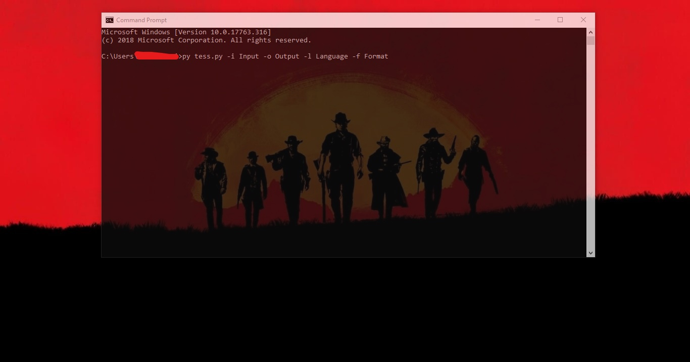
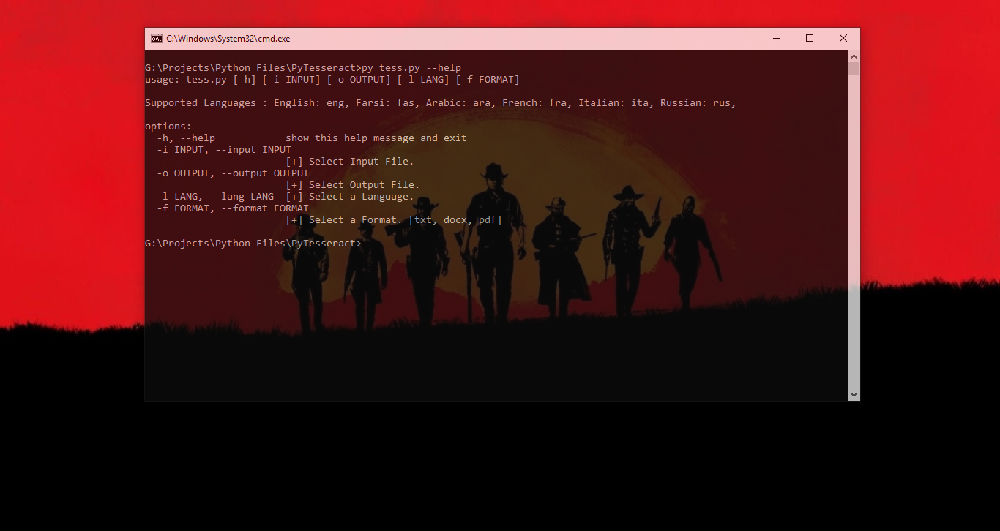

<h1 align="center">Hi 👋, I'm Ali</h1>
<h3 align="center">A Simple OCR Made With Python3.10.7 using pytesseract, Pillow, docx, fpdf, os and argparse Libraries</h3>

<h2>Demo</h2>


<hr>

<h2>Usage (How To Use)</h2>


<p>First Download Tesseract-OCR Engine From <a href="https://github.com/UB-Mannheim/tesseract/wiki">Here.</a></p>
<p>Then Install it. After Tesseract installation, Install the Python Packages:</p>
```
pip install pytesseract

pip install Pillow

pip install docx

pip install fpdf
```
<p>There you go, now you can run the python script.</p>

* Arguments:
> [-i], [-o], [-l], [-f] 

* [-i]:
<p>Select An Input File (jpg, png,...)</p>

* [-o]:
<p>Enter Output File's Name (.txt is default format)</p>

* [-l]:
<p>Select Your Language</p>

* [-f]:
<p>Select Format (.txt is default Format - Available: .txt .pdf .docx)</p>

<h2>Tesseract-OCR Settings</h2>

```

Page Segmentation modes:
  0    Orientation and script detection (OSD) only.
  1    Automatic page segmentation with OSD.
  2    Automatic page segmentation, but no OSD, or OCR.
  3    Fully automatic page segmentation, but no OSD. (Default)
  4    Assume a single column of text of variable sizes.
  5    Assume a single uniform block of vertically aligned text.
  6    Assume a single uniform block of text.
  7    Trate the image as a single text line.
  8    Trate the image as a single word.
  9    Trate the image as a single word in a circle.
  10   Trate the image as a single character.
  11   Sparse text. Find as musch text as possible in no particular order.
  12   Sparse text with OSD.
  13   Raw line. Treat the image as a single text line,
			bypassing hack that are Tesseract-specific.


OCR Engine Mode
0    Legacy engine only.
1    Neural nets LSTM engine only.
2    Legacy + LSTM engines.
3    Default, based on what is available.

```

<p align="left">  </p>

<p align="left"> <a href="https://github.com/ryo-ma/github-profile-trophy"></a> </p>

<h3 align="left">Languages and Tools:</h3>
<p align="left"> <a href="https://www.python.org" target="_blank" rel="noreferrer">  </a> </p>

<p></p>

<p>&nbsp;</p>